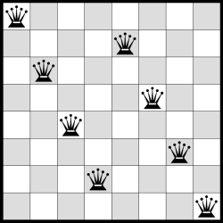

# Local Search Problem

## N Queen problem

In chess, the queen is the most powerful piece on the board. It can attack any piece in the same row, column or diagonal. In the 8-Queens problem, you are given an 8 x 8 chessboard with eight queens (and no other pieces) and the aim is to place the queens on the board so that none of them can attack each other. 

The problem was extended to solve the problem for N queens on an N x N chessboard. The position of the queens is initialized randomly, but with only one queen in each row. In this we will need to find only the column for the queens so that they don't attack each other.

### Hill climbing search

The hill-climbing search algorithm (steepest-ascent version) is simply a loop that continually moves in the direction of increasing value that is, uphill. It terminates when it reaches a “peak” where no neighbor has a higher value. The algorithm does not maintain a search tree, so the data structure for the current node need only record the state and the value of the objective function. Hill climbing does not look ahead beyond the immediate neighbors of the current state. 

We initialize the problem with random positions for the queens and we display each intermediate state of the chess board. To solve this problem we used as a heuristic the number of pairs of queens attacking each other, either directly or indirectly. 

The algorithm doesn't guarantee the optimal solution and it can get stuck in a local maxima.
