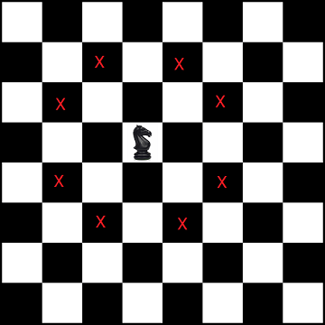

# Uninformed Search Problem

## Check Knight Problem | Find Shortest path from source to destination

Given a chess board, find the shortest distance (minimum number of steps) taken by a Knight to reach given destination from given source.

A knight can move in 8 posible directions for a given cell as ilustrated bellow.

### Proposed Algorithms

For this problem we propose two uninformed search algorithms: *Breadth First Search* and *Bidirectional Search*.

#### Prerequisites

We implemented the **Cell** class in order to represent the Chess Knight position. The class has a method for moving the knight (creates a new **Cell** instance) and a method for validating the new knight's position (it is in the boundries of the chess table and it moves to an unvisited position)

#### Breadth First Search (BFS)

We initialize the algorithm with the dimension of the chess table, the starting point for the knight and the destination. 

We add the starting point in the queue. While the queue is not empty, for each available movement we create a new position for the knight and check if it's valid. If the new position is valid, it is added to the queue. 

The algorithm ends when the knight reaches the destination.

#### Bidirectional Search

We initialize two *BFS* algorithms, one starting from the starting point and one from the destination. We try to alternate between the two queues, basically in every iteration we choose the smaller queue for the next iteration for the processing which effectively helps in alternating between the two queues only when the swapping between the two queues is profitable.

Since we are processing both the target and source queue we are not going to much depth from any direction, either in forward direction (i.e, while processing source queue) or in backward direction (i.e, target queue which searches from target to source in backward manner).

Since we are starting BFS from source and target and meeting somewhere in the middle we are processing moderate number of nodes from each direction. The algorithm ends when both searches meet.
